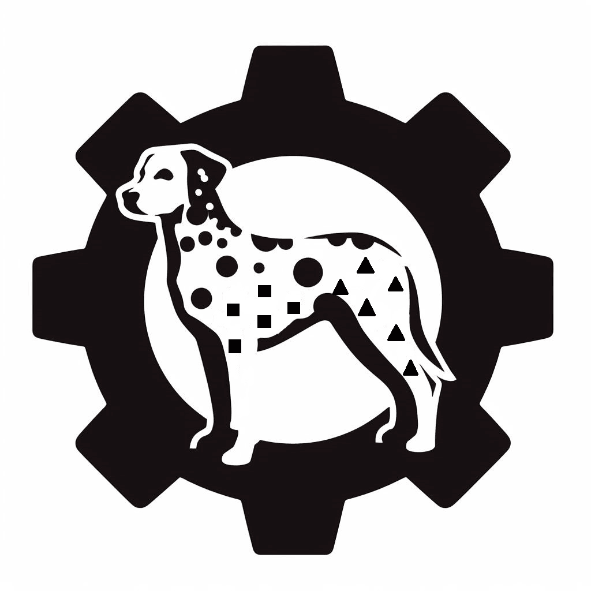

#  DAF

DINOS (**D**escription **I**nduced **F**rom **N**on **O**verlapped **S**ubgroups) is a subgroup discovery algorithm with a modular design (called internally DAF, **D**INOS **A**s **F**ramework), with the default settings providing a genetic algorithm for discovering varied and non redundant subgroups. It is a project of the Computer Science Faculty of the [Techonological University Of Havana José Antonio Echeverría](https://cujae.edu.cu/)
This is a KNIME extension using DINOS for several nodes, allowing to make DINOS much more useful by integrating it in a robust data analysis platform.

Credits (appropriate attribution):
- The DINOS algorithm was originally published by Lisandra Bravo Illisastigui, Diana Martín and Milton García Borroto with it's original nominal mode ( [original paper in Spansih](https://www.researchgate.net/publication/348407181_Nuevo_metodo_para_el_descubrimiento_de_subgrupos_no_redundantes) )
- The DAF library, was created by Alejandro Tomé de Armas
- The author of KNIME extension (Jonathan David González Pereda) developed it on it's own the extension, the reworking of DAF's external API, the parser and the numeric and survival modes

## Features:

- Nominal Mode, to obtain subgroup rules with string or booleans as targets (example: Petal.Length' in [1.0 ; 1.9] --> Species = "setosa")
- Numeric Mode, to obtain subgroup rules with integer or decimal (floats) as targets (example: temperature' in [97.2 ; 97.8] --> heart_rate in [58.0 ; 78.0])
- [Survival Analysis mode](https://link-url-here.org](https://en.wikipedia.org/wiki/Survival_analysis), to obtain subgroup rules in  data with censoring (note that to make sense of the data it is recommended to filter data from the instance port based on the desired value of the subgroup column and [the Kaplan Meier node]([https://link-url-here.org](https://en.wikipedia.org/wiki/Survival_analysis](https://hub.knime.com/knime/extensions/org.knime.features.stats2/latest/org.knime.base.node.stats.kaplanmeier2.KaplanMeierNodeFactory)
- Easily configurable (although with robust default settings) nodes
- Parser nodes for recreating subgroup discovery node results from text descriptions or even arbitrary hand made ones
- Extractor nodes to obtain an entire table as a single big subgroup. Mainly useful for making a Kaplan Meier graph comparing a subgroup with the entire dataset, by using concatenate with the instance output (filtered with the desired subgroups) and the results of the survival extractor
- Subgroup Discovery results with quality metrics in the first output port
- Which instance / row belongs to which subgroup in the second output port
- Parameters as flow variables in third output port (note: remember to override "useDefaults" with false)

## To Do

- Better guessing and sanity check of censoring value in the dialog table, without the need to execute the node
- Helper nodes to export survival results to R, the available Kaplan Meier node in KNIME is rather barebones
- Better icons for nodes

## Miscelaneous

- DAF uses the [ClassGraph](https://github.com/classgraph/classgraph?tab=readme-ov-file) by Luke Hutchison, under the MIT License:

Permission is hereby granted, free of charge, to any person obtaining a copy of this software and associated documentation files (the "Software"), to deal in the Software without restriction, including without limitation the rights to use, copy, modify, merge, publish, distribute, sublicense, and/or sell copies of the Software, and to permit persons to whom the Software is furnished to do so, subject to the following conditions:
The above copyright notice and this permission notice shall be included in all copies or substantial portions of the Software.
THE SOFTWARE IS PROVIDED "AS IS", WITHOUT WARRANTY OF ANY KIND, EXPRESS OR IMPLIED, INCLUDING BUT NOT LIMITED TO THE WARRANTIES OF MERCHANTABILITY, FITNESS FOR A PARTICULAR PURPOSE AND NONINFRINGEMENT. IN NO EVENT SHALL THE AUTHORS OR COPYRIGHT HOLDERS BE LIABLE FOR ANY CLAIM, DAMAGES OR OTHER LIABILITY, WHETHER IN AN ACTION OF CONTRACT, TORT OR OTHERWISE, ARISING FROM, OUT OF OR IN CONNECTION WITH THE SOFTWARE OR THE USE OR OTHER DEALINGS IN THE SOFTWAR
